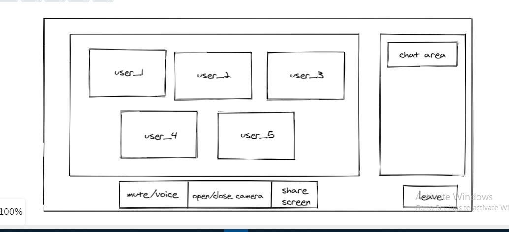
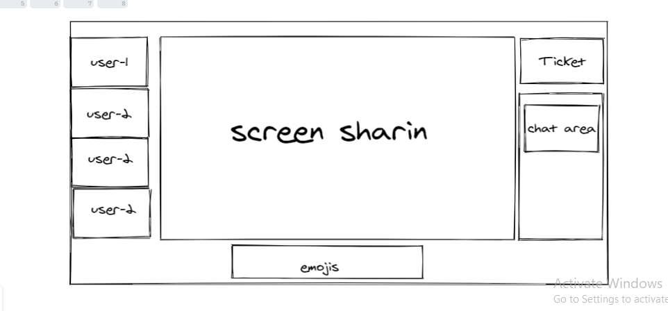

# LabTime

LabTime is a webapp built specifically for bootcamps lab time, it is like a online conference app but tuned to match all the required features for bootcamps labs. 

The webapp includes text, audio and video chat. Also you can share your screen and raise help tickets and so on.

## Wireframe

## Group members:
- [Mahmoud Alzoubi](https://github.com/Mahmoud-alzoubi95)
- [Noura Alquran](https://github.com/Noura-Alquran)
- [Nizar Alsaeed](https://github.com/NizarAlsaeed)
- [Omar Alzoubi](https://github.com/Omar-zoubi)
- [Raneem Abdulazeez](https://github.com/RaneemAbdulazez)
