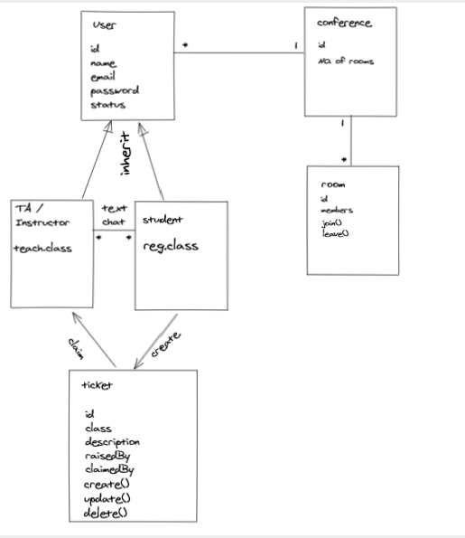

# LabTime

LabTime is a webapp built specifically for bootcamps lab time, it is like a online conference app but tuned to match all the required features for bootcamps labs. 

The webapp includes text, audio and video chat. Also you can share your screen and raise help tickets and so on.

## Wireframe

## Group members:
- [Mahmoud Alzoubi](https://github.com/Mahmoud-alzoubi95)
- [Noura Alquran](https://github.com/Noura-Alquran)
- [Nizar Alsaeed](https://github.com/NizarAlsaeed)
- [Omar Alzoubi](https://github.com/Omar-zoubi)
- [Raneem Abdulazeez](https://github.com/RaneemAbdulazez)

## User Stories
* The user can sign up our app and sign in anytime and enjoy the extraordinary features of our app.
 - The user can : 
 1. Start realtime video and/or audio as part of video conferncing
 2. Start chatting with other users.
 3. choose the room he/she wants to join.
 4. Enable/disable the camera
 5. mute/unmute mike
 6. Start screen sharing 
 7. raise tickets and ask for help
 8. be shown as available,busy,or not available.
 9. log out at any time he/she wants
 10. see the number of people available on the app.

* The user can get an optimized and easy to use app that fulfill the course lab requirements of an ideal lab environment.

# Domain Model

# Project Management

Check this [Link to Trello board](https://trello.com/b/boRm9Sbb) for all project tasks.

